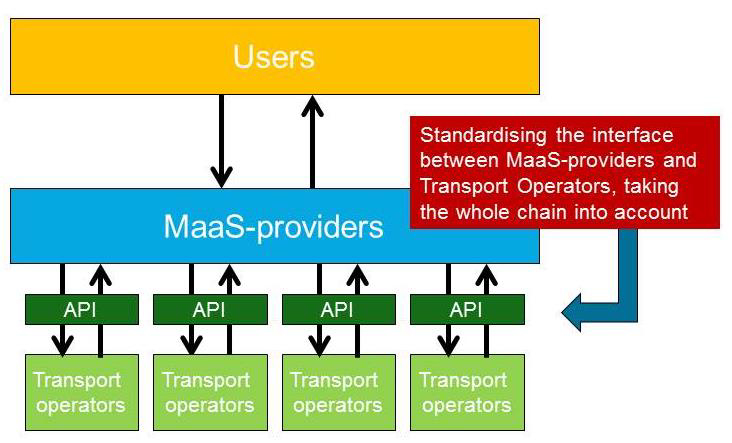

##1. Introduction
 Mobility as a Service (MaaS) offers the opportunity for seamless travel using any available transport mode. For MaaS to be successful, transport operators are required to share their transport services and availability of their assets in a digital form. To facilitate MaaS providers and thus enable the deployment of MaaS services, transport operators are also required to standardize the digital form to facilitate access to their information.
##2. Goal of this document
In this Blueprint for an Application Programming Interface (API) from Transport Operators (TO) to MaaS Providers (MP) we look into the necessary functional requirements for the interoperability between transport operators. The goal of this document is to:
 Define the necessary scope for full interoperability between transport operators for the deployment of MaaS services, always keeping the customer journey in mind to determine which calls are needed between MaaS-providers and Transport Operators.
 Define the necessary parameters and values to fulfill this scope
 Define the available parameters in various already available APIs and propose
amendments where applicable.

